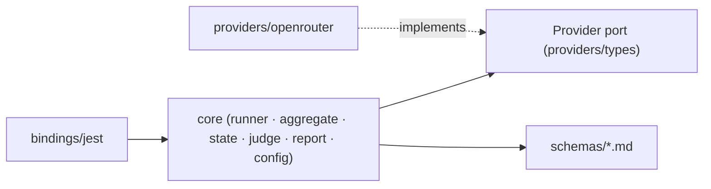
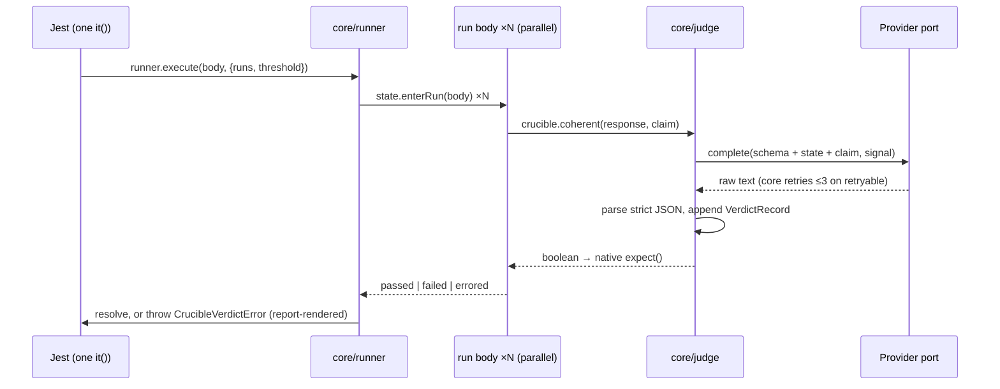

# Architecture Spine — crucible-ai

## Design Paradigm

**Ports & adapters, kept small**, inside the PRD's two-part split:

- **Deterministic shell** (this package, language-specific): `bindings/` → `core/` → `providers/` port. Core owns run orchestration, aggregation, state, judge orchestration, reporting, config. Adapters implement the `Provider` port. Bindings are inert one-liners over core's public API.
- **Non-deterministic core** (portable): `schemas/*.md` instruction files the judge executes. Semantics live here, never in TypeScript.

Directory map: `src/bindings/` (Jest), `src/core/` (runner, aggregate, state, judge, report, config), `src/providers/` (port + OpenRouter adapter), `schemas/` (instruction schemas).

## Invariants & Rules

### AD-1 — Shell/schema split `[ADOPTED]`

- **Binds:** all
- **Prevents:** assertion semantics leaking into TypeScript, making language ports re-implement judgment
- **Rule:** How an assertion is evaluated is defined only in its `schemas/*.md` file (FR-6). TypeScript maps calls to schemas, orchestrates runs, and transports verdicts — it never encodes evaluation logic. Changing judge behaviour must require no TS change.

### AD-2 — Dependency direction

- **Binds:** all
- **Prevents:** bindings entangling with provider internals; adapters growing core logic; Vitest/provider #2 requiring core surgery
- **Rule:** Dependencies point only along the arrows below. Core never imports an adapter or a binding; adapters and bindings never import each other; only `providers/registry` resolves the configured adapter behind the port, and only `core/config` calls the registry (AD-9).



### AD-3 — Test-level repetition, internal run loop `[ADOPTED]`

- **Binds:** FR-1, FR-2
- **Prevents:** runs surfacing as framework test cases (framework has no k-of-n verdict; each red run would fail CI even when the threshold is met); double-formatted or binding-formatted failures
- **Rule:** `crucible.it()` registers exactly one framework test whose body is `runner.execute(body, opts)` — registration is inert (stores options only). The runner executes the body `runs` times concurrently (`Promise.all`), resolves on aggregate pass, and throws `CrucibleVerdictError` on fail/errored; the error message is produced exclusively by `core/report` (a thrown failure message IS user-facing output under AD-10). Bindings never inspect, classify, or format results. Never use `it.each`/`it.concurrent` for runs. Defaults: omitted `runs` → 1 (smoke mode); omitted `threshold` → 1.0. The runner sets the framework's per-test timeout from the run count and provider budget — never rely on the framework default. Documented user contract: test bodies must be re-entrant (fresh SUT per arrange); parallelism is safe because runs share nothing.

### AD-4 — Three-zone integer-safe verdict

- **Binds:** FR-1, FR-7, FR-8
- **Prevents:** CI green without evidence; errored runs miscounted as semantic failures; floating-point drift making compliant aggregates (or language shells) disagree on identical run data
- **Rule:** Normative cross-language computation: `need = ⌈threshold × runs − 1e-9⌉` (epsilon absorbs IEEE-754 bump, e.g. `0.35 × 20 = 7.000000000000001`), with `threshold ∈ (0, 1]` validated so `need ≥ 1` — `threshold: 0` is rejected. Zones: `passed ≥ need` → **pass**; `passed + errored < need` → **fail** (semantic); otherwise → **errored** (inconclusive — the test fails, reported as *errored, not failed*, naming each infrastructure cause). Run-status classification mirrors native framework behaviour, no special machinery: a run is `passed` iff its body resolves; a rejection carrying `CrucibleError` of kind `infra` → `errored`; **any other rejection** (assertion error, SUT crash, user `TypeError`) → `failed`. User code that swallows an infra error leaves the run to settle by its body's outcome.

### AD-5 — Per-run state isolation via ambient scope

- **Binds:** FR-2, FR-3, FR-4
- **Prevents:** cross-run state bleed under parallel execution; API divergence from PRD samples (`ctx` parameter); two ALS owners / two store shapes that never compose
- **Rule:** `core/state` owns the **single** `AsyncLocalStorage` instance, holding one `RunContext { state: string[]; verdicts: VerdictRecord[]; errors: ErrorRecord[] }` per run. The runner enters scope only via `state.enterRun(body)`; `crucible.load/append`, the judge, and the reporter access the context only through `state` accessors (direct import, never passed as a parameter). Calling accessors outside a run scope fails fast. Public API stays ambient — no context handle. Cross-language contract: per-run ambient scope, realized per shell (`AsyncLocal`, `contextvars`, `ScopedValue`).

### AD-6 — Native boolean assertion surface `[ADOPTED]`

- **Binds:** FR-5
- **Prevents:** per-framework matcher maintenance; diagnostics coupled to assertion mechanics
- **Rule:** Assertions resolve to `Promise<boolean>`, asserted with the framework's native primitive. No custom matchers. The framework asserts; the core reporter explains (from run records, AD-13). New assertion types must follow the same boolean contract.

### AD-7 — Judge = single stateless completion

- **Binds:** FR-5, FR-6
- **Prevents:** multi-turn agent complexity; per-adapter verdict formats; unportable judge behaviour
- **Rule:** One provider completion per assertion call: system prompt = the assertion's instruction schema; user content = state + response + claim. The schema itself demands strict JSON `{ "verdict": boolean, "reasoning": string }`; structured-output parameters are used when the configured model supports them, but the contract never depends on it. Parsing, validation, and the unparseable→retryable classification live only in `core/judge` — anything unparseable is a retryable infrastructure error, never a semantic verdict. (MVP deliberately narrows the PRD's "judge agent" to a single completion; agentic judging is a deferred path.)

### AD-8 — Provider port and error taxonomy

- **Binds:** FR-2, FR-7
- **Prevents:** divergent retry/error behaviour per adapter; adapters quietly re-creating per-adapter verdict parsing; auth failures burning 20 runs of spend
- **Rule:** The port is `complete(request, signal: AbortSignal): Promise<string>` — raw completion text; adapters never see verdict semantics. An adapter implements exactly: send the request, classify each failure `retryable` (429, timeout, 5xx) or `fatal` (400, 401, unknown model), and declare its API-key env var. Core — never adapters — owns retry: max 3 attempts, exponential backoff with jitter, then the run is *errored*. The runner holds one `AbortController` per test: on the first `fatal` classification it aborts all sibling runs, discards in-flight aborted runs (neither failed nor errored), and throws immediately. Infrastructure failures are never semantic failures (FR-7 `[ADOPTED]`).

### AD-9 — Config and secrets `[ADOPTED]`

- **Binds:** FR-7, FR-9
- **Prevents:** keys in committable files; per-module config re-reads and double validation drifting; suite collection failing on config errors; late crashes mid-spend
- **Rule:** `crucible.config.json` (project root, committable) holds provider, model, `meta` passthrough, verbosity default, and optional `testDefaults` (`runs`, `threshold`) — resolution precedence: `crucible.it()` param > config `testDefaults` (per-field) > built-in (`runs: 1`, `threshold: 1.0`), resolved at execution time. `testDefaults` are validated at load like every other config field. `config.get()` is memoized and first invoked at execution of the first run — never at registration. Config load itself resolves the adapter via `providers/registry` (unknown provider = load-time failure with actionable error; `config.get().provider` is the resolved adapter singleton — the judge never touches the registry) and computes `effectiveVerbosity` (env override applied). API keys come only from the adapter's declared provider-native env var (`OPENROUTER_API_KEY`); `CRUCIBLE_`-prefixed vars are reserved for crucible-owned settings.

### AD-10 — Reporter owns all output

- **Binds:** FR-8, FR-9
- **Prevents:** scattered `console.log`; interleaved output under parallel runs; verbosity honored in some modules and not others
- **Rule:** All user-facing output — including the `CrucibleVerdictError` message (AD-3) — is rendered by `core/report`, exclusively from the run records (AD-13) at verdict time; nothing prints mid-run at `default` level. Report filters by the `effectiveVerbosity` resolved in config (AD-9): `default` = pass rate vs threshold + per failing run its first failed assertion's claim, bounded response excerpt, and judge reasoning (FR-8); `full` = all judge output per run; `debug` = engine init, run execution, provider traffic. stdout only — no file output. Errored runs render visually distinct from failed runs.

### AD-11 — Schemas ship in the package

- **Binds:** FR-6
- **Prevents:** schema/library version skew; premature registry infrastructure
- **Rule:** Instruction schemas live in `schemas/*.md`, named after their assertion (`coherent.md`), versioned solely by the package version. Each file carries frontmatter (`name`, output contract) so the format stays registry-ready for cross-language extraction.

### AD-12 — Test & release envelope `[ADOPTED]`

- **Binds:** all (operational)
- **Prevents:** provider spend and provider secrets in CI; untested publishes
- **Rule:** CI (GitHub Actions) has two lanes. PR lane: lint + typecheck + unit tests only — zero provider traffic, no provider key. Main lane (merge to main): additionally runs `make e2e-core` against real OpenRouter via an `OPENROUTER_API_KEY` repo secret. e2e tests otherwise run locally and manually — no pre-commit hook; Makefile exposes `e2e-core` / `e2e-ext` / `e2e`, split `e2e/core` (critical paths, minimal) and `e2e/ext`. Publishing is tag-triggered: `v*` tag → GH Action runs unit tests → `npm publish` with provenance, authenticated via npm Trusted Publishing (OIDC) — or an `NPM_TOKEN` secret as fallback. Permitted CI secrets: exactly the npm credential (publish) and `OPENROUTER_API_KEY` (main lane). Convention: `make e2e` locally before tagging.

### AD-13 — Run-record contract

- **Binds:** FR-5, FR-8
- **Prevents:** judge reasoning discarded before report time; multi-assertion failure attribution impossible; reporter and judge built to incompatible data expectations
- **Rule:** Before resolving its boolean, `core/judge` appends `VerdictRecord { assertion, claim, verdict, reasoning, seq }` — and on exhausted retries `ErrorRecord { cause, attempts }` — to the ambient `RunContext` (AD-5). These records are the single source for everything the reporter renders. A "first judge error per failing run" (FR-8) means the lowest-`seq` false verdict or error record of that run.

## Consistency Conventions

| Concern | Convention |
| --- | --- |
| Public API | One namespace: `crucible` (`crucible.it/load/append/coherent`), re-exported by the main entry. Bindings reach framework globals lazily at call time (Jest = peer, never a dependency); future bindings may add subpath entries (`crucible-ai/vitest`), never new namespaces |
| Naming | Files kebab-case; schema file name = assertion name; adapters named after provider (`openrouter.ts`) |
| Terminology | "state" — never domain vocabulary ("world state", "chat history") in API, docs, or artifacts; domain examples illustrate, never define |
| Data & formats | User state = `string[]` field of `RunContext`, append-only within a run; threshold = decimal in `(0,1]`; run status = `passed \| failed \| errored \| discarded`; verdict JSON = `{ verdict, reasoning }` |
| Errors | One `CrucibleError` base with `kind: 'config' \| 'usage' \| 'infra'`; config/usage thrown at call site; infra carries `retryable` flag and provider cause; verdicts surface as `CrucibleVerdictError` |
| Cross-cutting | No `console.*` outside `core/report`; env access only in `core/config` + adapter key lookup; no ambient state beyond the AD-5 store |

## Stack

| Name | Version |
| --- | --- |
| TypeScript | 6.x (7.0 GA 2026-07-08, native compiler — adopt post-MVP once programmatic API and tooling settle) |
| Node.js | engines `>=22` (20 EOL 2026-04-30); CI matrix 22 / 24 |
| Jest (binding target + own tests) | 30 |
| tsdown (build, dual ESM+CJS) | current (rolldown-based; replaced unmaintained tsup, verified 2026-08-10) |
| OpenRouter API | chat completions; structured outputs per-model (verified 2026-08-10) |
| GitHub Actions | CI + tag-triggered publish (npm Trusted Publishing / OIDC) |

## Structural Seed

```text
crucible-ai/
  src/
    index.ts            # public `crucible` namespace
    bindings/jest.ts    # crucible.it registrar (inert one-liner)
    core/
      runner.ts         # run loop, AbortController, timeout, parallelism
      aggregate.ts      # three-zone verdict (AD-4)
      state.ts          # single ALS + RunContext (AD-5, AD-13)
      judge.ts          # schema → completion → parse → record (AD-7, AD-13)
      report.ts         # renders from records, verbosity filter (AD-10)
      config.ts         # memoized load, registry resolve, verbosity (AD-9)
    providers/
      types.ts          # Provider port: complete(request, signal) (AD-8)
      openrouter.ts     # MVP adapter
      registry.ts       # config value → adapter (called by config only)
  schemas/coherent.md   # instruction schema (AD-1, AD-11)
  e2e/core/  e2e/ext/   # local-only, real provider (AD-12)
  docs/                 # getting started (runs/threshold headroom guidance),
                        # OpenRouter config page, schema explainer,
                        # unasserted-verdict gotcha (PRD §6.1)
  Makefile              # e2e-core / e2e-ext / e2e
  .github/workflows/    # ci.yml (unit), publish.yml (tag → npm, OIDC)
  crucible.config.json  # dogfood config (committable)
```

Run lifecycle (one `crucible.it` with `runs: N`):



## Capability → Architecture Map

| Capability | Lives in | Governed by |
| --- | --- | --- |
| FR-1 declare inference test | `bindings/jest`, `core/runner`, `core/aggregate` | AD-3, AD-4 |
| FR-2 parallel runs | `core/runner` | AD-3, AD-5, AD-8 |
| FR-3/FR-4 load & append state | `core/state` via ambient scope | AD-5 |
| FR-5 coherence assertion | `core/judge` + `schemas/coherent.md` | AD-6, AD-7, AD-13 |
| FR-6 schema-driven judging | `schemas/`, `core/judge` | AD-1, AD-11 |
| FR-7 provider config | `core/config`, `providers/*` | AD-8, AD-9 |
| FR-8 failure output | `core/report`, `core/aggregate` | AD-4, AD-10, AD-13 |
| FR-9 verbosity ladder | `core/report`, `core/config` | AD-9, AD-10 |

## Deferred

- **Vitest binding** — `bindings/` seam + subpath export reserved; revisit if MVP lands quickly (PRD OQ-4).
- **Serial execution / concurrency caps** — post-MVP config; AD-8 retry absorbs MVP-scale rate limiting (PRD non-goal).
- **Second provider (Bedrock etc.)** — needs its own adapter + docs page; port contract (AD-8) already fixes the shape.
- **Cross-language schema extraction** — revisit when the second language shell starts (AD-11 keeps files registry-ready).
- **Judge model guidance (PRD OQ-6)** — recommended judge models + reliability stance documented at GA, after `coherent.md` is tuned in e2e; MVP config example stays `deepseek-v3`. Owner: Jack; revisit before publish.
- **Agentic judging** — AD-7 narrows the judge to a single completion for MVP; a multi-turn/tool-using judge is a possible future schema-execution mode.
- **Custom state-parsing instructions; typed state** — post-MVP idea (PRD non-goal).
- **Judge-verdict caching / cost optimization** — post-MVP (PRD non-goal).
- **Response excerpt cap** — default ~500 chars, configurable; a reporter setting, not an invariant (PRD assumption).
- **TypeScript 7 adoption** — after the native compiler's programmatic API (7.1) and tooling support settle.
